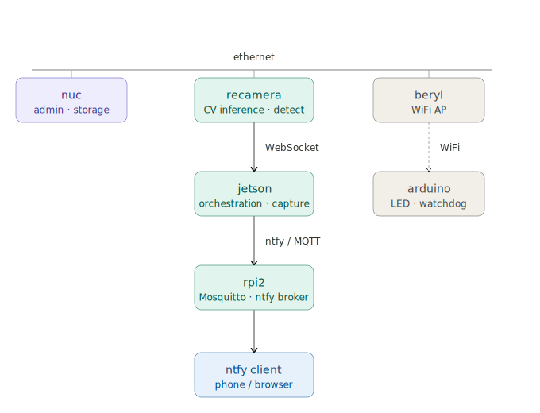

# hummingbird-pipeline

CV-based hummingbird detection and frame capture pipeline using edge AI inference
on a reCamera, orchestrated by a Jetson, with Arduino alerting and RPi notification brokering.

## Status

Data collection phase — pipeline is running and capturing frames. No trained model yet.


## Requirements

**Admin machine** — any Linux, macOS, or WSL environment with:
- Ansible
- Python 3.x
- SSH access to lab devices
- `~/.ssh/birdcam_lab` key configured

**Pipeline devices** — see [Devices](docs/devices.md) for hardware specifics

**Python dependencies** (for test and utility scripts):
- websockets
- requests

Install via:
```bash
pip install websockets requests
```

The admin machine is not part of the pipeline — use whatever you have.

**Monitoring** (optional) — any always-on device on the network with:
- Grafana
- Prometheus
- prometheus-node-exporter on each device you want to monitor

See [Architecture](docs/architecture.md) for details.

## Hardware

| Device | Model | Role |
|--------|-------|------|
| reCamera | Seeed reCamera 2002W (SG2002, OV5647, 64GB) | Sensor + CV inference |
| Jetson | reComputer J3011 (Orin Nano 8GB, JetPack 5.1.1) | Orchestration + frame capture |
| Arduino | R4 WiFi | LED matrix display + heartbeat watchdog |
| RPi | Raspberry Pi 5 | Mosquitto + ntfy notification broker |
| Beryl | GL.iNet Beryl (MT-1300) | WiFi access point |

> **Note on WiFi AP**: The Beryl was chosen specifically for reliable AP mode.
> The GL.iNet Opal (MT300N-V2) has known issues in AP mode that caused
> connectivity problems with the reCamera — avoid it for this use case.

## Configuration

Network addresses and credentials are not committed to this repo.
To see all files requiring configuration:

```bash
grep -r '\${' --include="*.py" --include="*.conf" --include="*.ini" --include="*.h" . | grep -v bin/
```

## Docs

- [Architecture](docs/architecture.md)
- [Decisions](docs/decisions.md)
- [Devices](docs/devices.md)
- [Models](docs/models.md)

## Disclaimer

This is a personal project shared as-is. Hardware setup, dependency management,
and deployment are non-trivial — particularly on the Jetson. Proceed with caution
and don't run deployment scripts you don't fully understand on production systems.
